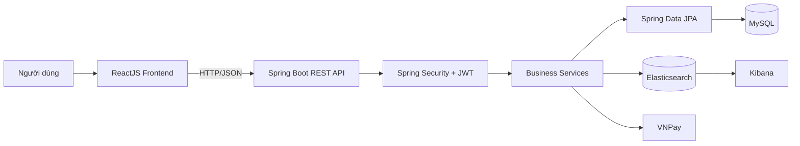
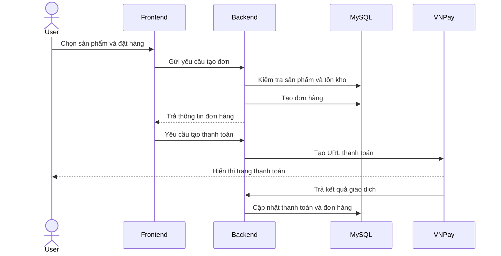
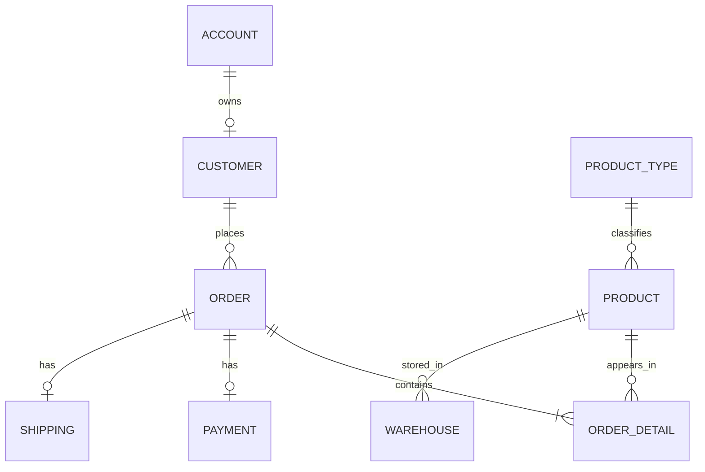

# DATN Web — Website bán đồng hồ đeo tay

Dự án thương mại điện tử Full-stack được xây dựng nhằm mô phỏng quy trình vận hành của một website bán đồng hồ: quản lý tài khoản, sản phẩm, giỏ hàng, đơn hàng, thanh toán trực tuyến, tồn kho và tìm kiếm sản phẩm.

> **Vai trò:** Full-stack Developer  
> **Repository:** [BuiCongDat2905/DATN_Web](https://github.com/BuiCongDat2905/DATN_Web)

---

## 1. Giới thiệu

Dự án được phát triển bằng **Java Spring Boot** ở Backend và **ReactJS** ở Frontend. Hệ thống cung cấp RESTful API cho các nghiệp vụ chính của một website thương mại điện tử, triển khai xác thực và phân quyền bằng **Spring Security + JWT**, lưu trữ dữ liệu bằng **MySQL**, tìm kiếm sản phẩm bằng **Elasticsearch** và tích hợp thanh toán trực tuyến qua **VNPay**.

Mục tiêu của dự án:

- Áp dụng mô hình Full-stack vào một bài toán thực tế.
- Thiết kế RESTful API và cơ sở dữ liệu quan hệ.
- Xây dựng quy trình xác thực, phân quyền và bảo vệ API.
- Xử lý nghiệp vụ giỏ hàng, đặt hàng, thanh toán và tồn kho.
- Tích hợp Elasticsearch để cải thiện khả năng tìm kiếm sản phẩm.
- Sử dụng Docker Compose để khởi tạo các dịch vụ phụ thuộc.

---

## 2. Chức năng chính

### Người dùng

- Đăng ký và đăng nhập tài khoản.
- Xác thực bằng JWT.
- Xem danh sách và chi tiết sản phẩm.
- Tìm kiếm, lọc, sắp xếp và phân trang sản phẩm.
- Thêm, cập nhật và xóa sản phẩm trong giỏ hàng.
- Tạo đơn hàng từ giỏ hàng.
- Thanh toán trực tuyến thông qua VNPay.
- Theo dõi trạng thái đơn hàng.

### Quản trị viên

- Quản lý tài khoản và phân quyền người dùng.
- Thêm, sửa, xóa và xem sản phẩm.
- Quản lý loại sản phẩm.
- Quản lý kho hàng, số lượng tồn và số lượng đã bán.
- Theo dõi và cập nhật trạng thái đơn hàng.
- Theo dõi thông tin thanh toán.
- Đồng bộ dữ liệu sản phẩm từ MySQL sang Elasticsearch.
- Xem dữ liệu tổng hợp phục vụ trang quản trị.

---

## 3. Công nghệ sử dụng

### Backend

- Java
- Spring Boot
- Spring MVC
- Spring Security
- JWT
- Spring Data JPA
- Hibernate
- Bean Validation
- RESTful API
- Maven

### Frontend

- ReactJS
- JavaScript
- HTML5
- CSS3
- REST API Integration

### Database và tìm kiếm

- MySQL
- Elasticsearch
- Kibana

### Công nghệ và công cụ khác

- Docker
- Docker Compose
- VNPay
- Git và GitHub
- Postman
- IntelliJ IDEA
- Visual Studio Code

---

## 4. Kiến trúc tổng quan



Backend được tổ chức theo hướng phân tầng:

```text
Controller
    ↓
Service
    ↓
Repository
    ↓
Database
```

- **Controller:** tiếp nhận request và trả response.
- **Service:** xử lý nghiệp vụ.
- **Repository:** truy cập dữ liệu thông qua JPA/Hibernate.
- **DTO:** trao đổi dữ liệu giữa Client và Server.
- **Security Filter:** kiểm tra JWT và quyền truy cập API.
- **Elasticsearch Service:** tìm kiếm, lọc, sắp xếp và phân trang sản phẩm.

---

## 5. Các module nghiệp vụ

```text
Authentication
Account
Customer
Product
Product Type
Cart
Order
Order Detail
Warehouse
Payment
Shipping
Search
Dashboard
```

### Luồng đặt hàng



---

## 6. Cấu trúc thư mục dự kiến

Tên thư mục thực tế có thể khác tùy phiên bản của repository.

```text
DATN_Web/
├── BE/
│   └── sellWatches/
│       └── sellWatches/
│           ├── src/
│           │   ├── main/
│           │   │   ├── java/
│           │   │   └── resources/
│           │   └── test/
│           ├── pom.xml
│           └── docker-compose.yml
├── FE/
│   ├── src/
│   ├── public/
│   └── package.json
└── README.md
```

---

## 7. Yêu cầu môi trường

Cài đặt các công cụ sau trước khi chạy dự án:

- Java 17 trở lên.
- Maven 3.9 trở lên hoặc Maven Wrapper.
- Node.js 18 trở lên.
- npm.
- Docker Desktop.
- Git.

Kiểm tra phiên bản:

```bash
java -version
mvn -version
node -v
npm -v
docker --version
docker compose version
```

---

## 8. Cài đặt dự án

### Bước 1: Clone repository

```bash
git clone https://github.com/BuiCongDat2905/DATN_Web.git
cd DATN_Web
```

### Bước 2: Khởi động MySQL, Elasticsearch và Kibana

Di chuyển tới thư mục chứa `docker-compose.yml`:

```bash
cd BE/sellWatches/sellWatches
docker compose up -d
```

Kiểm tra container:

```bash
docker compose ps
```

Các cổng thường được sử dụng:

| Dịch vụ | Địa chỉ |
|---|---|
| Backend | `http://localhost:8080` |
| Frontend | `http://localhost:3000` |
| MySQL | `localhost:3307` |
| Elasticsearch | `http://localhost:9200` |
| Kibana | `http://localhost:5601` |

> Hãy kiểm tra lại `docker-compose.yml` và file cấu hình của dự án nếu cổng thực tế khác bảng trên.

---

## 9. Cấu hình Backend

Tạo hoặc cập nhật file:

```text
src/main/resources/application.properties
```

Cấu hình tham khảo:

```properties
spring.application.name=sellWatches

spring.datasource.url=jdbc:mysql://localhost:3307/db_sellwatches?useSSL=false&allowPublicKeyRetrieval=true&serverTimezone=Asia/Ho_Chi_Minh
spring.datasource.username=root
spring.datasource.password=YOUR_DATABASE_PASSWORD
spring.datasource.driver-class-name=com.mysql.cj.jdbc.Driver

spring.jpa.hibernate.ddl-auto=update
spring.jpa.show-sql=false
spring.jpa.properties.hibernate.format_sql=true

spring.elasticsearch.uris=http://localhost:9200

app.jwt.secret=YOUR_BASE64_JWT_SECRET
app.jwt.expiration=86400000

vnpay.tmn-code=YOUR_VNPAY_TMN_CODE
vnpay.hash-secret=YOUR_VNPAY_HASH_SECRET
vnpay.payment-url=YOUR_VNPAY_PAYMENT_URL
vnpay.return-url=http://localhost:3000/payment-result
```

### Bảo mật thông tin cấu hình

Không commit các thông tin sau lên GitHub:

- Mật khẩu MySQL.
- JWT Secret.
- VNPay Secret.
- API Key.
- Mật khẩu email.
- Token hoặc thông tin tài khoản thử nghiệm quan trọng.

Có thể sử dụng biến môi trường:

```properties
spring.datasource.password=${DB_PASSWORD}
app.jwt.secret=${JWT_SECRET}
vnpay.tmn-code=${VNPAY_TMN_CODE}
vnpay.hash-secret=${VNPAY_HASH_SECRET}
```

Tạo file `.env.example` để mô tả các biến cần thiết:

```env
DB_PASSWORD=
JWT_SECRET=
VNPAY_TMN_CODE=
VNPAY_HASH_SECRET=
```

---

## 10. Chạy Backend

Tại thư mục chứa `pom.xml`:

### Windows PowerShell

```powershell
.\mvnw.cmd spring-boot:run
```

Hoặc:

```powershell
mvn spring-boot:run
```

### Linux/macOS

```bash
./mvnw spring-boot:run
```

Backend mặc định:

```text
http://localhost:8080
```

---

## 11. Chạy Frontend

Di chuyển đến thư mục Frontend:

```bash
cd FE
npm install
npm start
```

Nếu dự án sử dụng Vite:

```bash
npm run dev
```

Frontend thường chạy tại:

```text
http://localhost:3000
```

> Xem trường `scripts` trong `package.json` để xác định chính xác lệnh chạy.

---

## 12. Đồng bộ dữ liệu Elasticsearch

Sau khi MySQL và Elasticsearch hoạt động:

1. Chạy Backend.
2. Đảm bảo bảng sản phẩm đã có dữ liệu.
3. Gọi API đồng bộ/reindex được định nghĩa trong Backend.
4. Kiểm tra index `products` trong Elasticsearch.

Kiểm tra bằng Kibana Dev Tools:

```http
GET products/_search
{
  "query": {
    "match_all": {}
  }
}
```

Ví dụ tìm kiếm:

```http
GET products/_search
{
  "query": {
    "match": {
      "ten_san_pham": "Casio"
    }
  }
}
```

---

## 13. API tiêu biểu

Tên endpoint có thể thay đổi theo source code thực tế.

### Authentication

| Method | Endpoint | Mô tả |
|---|---|---|
| POST | `/auth/login` | Đăng nhập |
| POST | `/auth/register` | Đăng ký |
| POST | `/auth/refresh` | Làm mới Access Token |
| POST | `/auth/logout` | Đăng xuất |

### Product

| Method | Endpoint | Mô tả |
|---|---|---|
| GET | `/products` | Lấy danh sách sản phẩm |
| POST | `/products/search` | Tìm kiếm và lọc sản phẩm |
| GET | `/products/{id}` | Xem chi tiết sản phẩm |
| POST | `/products/addProduct` | Thêm sản phẩm |
| PUT | `/products/update` | Cập nhật sản phẩm |
| DELETE | `/products/remove` | Xóa sản phẩm |

### Cart và Order

| Method | Endpoint | Mô tả |
|---|---|---|
| GET | `/cart` | Xem giỏ hàng |
| POST | `/cart` | Thêm sản phẩm vào giỏ |
| PUT | `/cart` | Cập nhật số lượng |
| DELETE | `/cart/{id}` | Xóa sản phẩm khỏi giỏ |
| POST | `/order` | Tạo đơn hàng |
| GET | `/order/{id}` | Xem chi tiết đơn hàng |

### Payment

| Method | Endpoint | Mô tả |
|---|---|---|
| POST | `/payment/create` | Tạo yêu cầu thanh toán |
| GET | `/payment/callback` | Nhận kết quả thanh toán |
| GET | `/payment/dataAdmin` | Xem dữ liệu thanh toán quản trị |

> Nên cập nhật bảng này theo đúng endpoint hiện có trong các class Controller.

---

## 14. Mô hình dữ liệu chính



Các entity chính:

- `Account`: tài khoản đăng nhập và quyền truy cập.
- `Customer`: thông tin khách hàng.
- `Product`: thông tin sản phẩm đồng hồ.
- `ProductType`: loại sản phẩm.
- `Warehouse`: tồn kho, số lượng đã bán và giá nhập.
- `Order`: thông tin đơn hàng.
- `OrderDetail`: sản phẩm và số lượng trong từng đơn.
- `Payment`: thông tin giao dịch thanh toán.
- `Shipping`: thông tin vận chuyển.

---

## 15. Kiểm thử API

Có thể dùng Postman để kiểm thử:

1. Đăng ký hoặc đăng nhập.
2. Lấy Access Token.
3. Thêm header:

```http
Authorization: Bearer YOUR_ACCESS_TOKEN
```

4. Gửi request đến API cần xác thực.
5. Kiểm tra status code và response body.

Các trường hợp nên kiểm thử:

- Đăng nhập đúng và sai mật khẩu.
- Request không có token.
- Token hết hạn hoặc không hợp lệ.
- User truy cập API dành cho Admin.
- Thêm sản phẩm với dữ liệu thiếu.
- Đặt hàng vượt quá tồn kho.
- Thanh toán thành công, thất bại hoặc bị hủy.
- Tìm kiếm với keyword rỗng.
- Phân trang ngoài phạm vi.

---

## 16. Ảnh giao diện

Tạo thư mục:

```text
docs/images/
```

Sau đó thêm ảnh và cập nhật phần này:

```markdown
### Trang chủ


### Chi tiết sản phẩm


### Giỏ hàng


### Thanh toán


### Trang quản trị


```

Nên có từ 4 đến 8 ảnh để nhà tuyển dụng có thể hiểu nhanh sản phẩm mà không cần chạy source code.

---

## 17. Tài khoản demo

Chỉ công khai tài khoản demo không chứa dữ liệu quan trọng.

```text
User:
Email: user@example.com
Password: ********

Admin:
Email: admin@example.com
Password: ********
```

> Cập nhật lại bằng tài khoản demo thực tế. Không đăng mật khẩu đang sử dụng cho hệ thống thật.

---

## 18. Những vấn đề kỹ thuật đã xử lý

- Thiết kế RESTful API theo mô hình Controller — Service — Repository.
- Tách DTO khỏi Entity để kiểm soát dữ liệu request và response.
- Xác thực và phân quyền bằng Spring Security và JWT.
- Mô hình hóa quan hệ giữa sản phẩm, kho, khách hàng, đơn hàng và thanh toán.
- Tích hợp VNPay và cập nhật trạng thái giao dịch.
- Đồng bộ dữ liệu sản phẩm từ MySQL sang Elasticsearch.
- Tìm kiếm, lọc, sắp xếp và phân trang sản phẩm.
- Khởi tạo MySQL, Elasticsearch và Kibana bằng Docker Compose.
- Kiểm thử và debug API bằng Postman.
- Xử lý CORS giữa ReactJS và Spring Boot.

---

## 19. Hướng phát triển

- Bổ sung Refresh Token rotation và thu hồi token.
- Tích hợp Redis để cache dữ liệu sản phẩm.
- Sử dụng RabbitMQ hoặc Kafka cho email và xử lý đơn hàng bất đồng bộ.
- Viết Unit Test và Integration Test bằng JUnit, Mockito và Testcontainers.
- Tạo tài liệu API bằng Swagger/OpenAPI.
- Bổ sung logging và audit log.
- Xử lý đồng thời khi nhiều người mua cùng một sản phẩm.
- Thêm Optimistic Lock cho tồn kho.
- Docker hóa toàn bộ Backend và Frontend.
- Xây dựng CI/CD bằng GitHub Actions.
- Triển khai hệ thống lên cloud.
- Bổ sung giám sát bằng Prometheus và Grafana.

---

## 20. Tác giả

**Bùi Công Đạt**

- GitHub: [BuiCongDat2905](https://github.com/BuiCongDat2905)
- Email: `datcongh43@gmail.com`
- Định hướng: Java Backend / Full-stack Developer

---

## 21. Lưu ý

Dự án được xây dựng với mục đích học tập, thực hành và hoàn thiện đồ án tốt nghiệp. Một số cấu hình, endpoint hoặc tên thư mục trong tài liệu cần được điều chỉnh theo phiên bản source code hiện tại.
